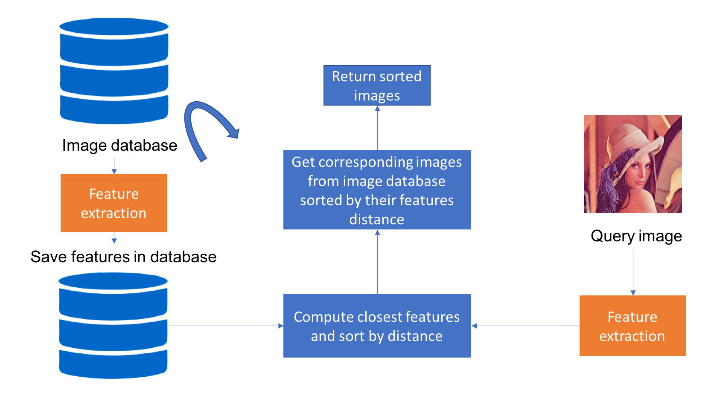

# Content-based Image Retrieval (CBIR)



A system that finds similar images using visual features rather than metadata. This project compares various feature
extraction algorithms and similarity metrics to determine the most effective combination for image retrieval tasks.

## Table of Contents

1. [Overview](#overview)
2. [Project Structure](#project-structure)
3. [Installation](#installation)
4. [Usage](#usage)
5. [Results and Findings](#results-and-findings)
6. [License](#license)

## Overview

[Content-based image retrieval](https://en.wikipedia.org/wiki/Content-based_image_retrieval) (CBIR) is a computer
vision technique for searching digital images in large databases based on their visual content rather than metadata
or text annotations.

The process consists of four steps:
1. Extract features from an image database to form a feature database
2. Extract features from the query image
3. Find the most similar features in the database
4. Return the images associated with the most similar features

### Research Objective

This project compares different combinations of feature extraction algorithms and similarity metrics to identify
the most effective approach for image retrieval tasks.

#### Feature Extraction Methods
* Traditional Computer Vision:
  * [AKAZE](https://docs.opencv.org/3.4/db/d70/tutorial_akaze_matching.html) - Fast local feature detector and descriptor
  * [ORB](https://opencv-python-tutroals.readthedocs.io/en/latest/py_tutorials/py_feature2d/py_orb/py_orb.html) - Oriented FAST and Rotated BRIEF features
* Deep Learning:
  * [VGG16](https://neurohive.io/en/popular-networks/vgg16/) - 16-layer CNN architecture
  * [NasNet](https://paperswithcode.com/model/nasnet?variant=nasnetalarge) - Neural Architecture Search Network
  * [EfficientNet](https://paperswithcode.com/method/efficientnet) - Scalable and efficient CNN

#### Similarity Metrics
* [Cosine Similarity](https://en.wikipedia.org/wiki/Cosine_similarity) - Measure of similarity between two non-zero vectors
* [Manhattan Distance](https://en.wikipedia.org/wiki/Manhattan_distance) - Sum of absolute differences between coordinates
* [Euclidean Distance](https://en.wikipedia.org/wiki/Euclidean_space) - "Ordinary" straight-line distance between points

### Evaluation Dataset

We used the [Apparel Images Dataset](https://www.kaggle.com/trolukovich/apparel-images-dataset) from Kaggle, which
contains various clothing items organized by category.

### Evaluation Metrics
* [Mean Average Precision (MAP)](https://en.wikipedia.org/wiki/Evaluation_measures_(information_retrieval)#Mean_average_precision) - Assesses overall system retrieval quality
* [Mean Reciprocal Rank (MRR)](https://en.wikipedia.org/wiki/Mean_reciprocal_rank) - Evaluates the rank of the first relevant item
* First Rank Accuracy - Percentage of queries where the first result is relevant
* Average query time - Performance measurement in seconds

## Project Structure

```bash
├── data/               # Data directory (created by make prepare)
│   ├── inputs/         # Raw and processed input images
│   ├── features/       # Extracted feature vectors
│   └── evaluation/     # Evaluation results
├── notebooks/          # Jupyter notebooks for analysis and visualization
├── reports/            # Generated evaluation reports and images
│   └── images/         # Visualizations and diagrams
├── src/                # Source code
│   ├── addons/         # Core functionality
│   │   ├── extraction/ # Feature extraction algorithms
│   │   └── metrics.py  # Evaluation metrics
│   ├── data/           # Data processing utilities
│   ├── features/       # Feature generation scripts
│   └── models/         # Prediction and model utilities
├── tests/              # Unit tests
├── Makefile            # Automation scripts
├── pyproject.toml      # Project dependencies and metadata
└── README.md           # Project documentation
```

## Installation

### Prerequisites
- Python 3.12+
- [uv](https://docs.astral.sh/uv/getting-started/installation/) for dependency management
- Kaggle account for dataset access

### Setup

1. Clone the repository:
   ```bash
   git clone https://github.com/schalappe/content-based-image-retrieval.git
   cd content-based-image-retrieval
   ```

2. Set up the environment and install dependencies:
   ```bash
   make venv
   ```

3. Prepare the project structure and configuration:
   ```bash
   make prepare
   ```

4. Download the [Apparel Images Dataset](https://www.kaggle.com/trolukovich/apparel-images-dataset) from Kaggle and place it in the `data/inputs` directory.

5. Generate feature vectors:
   ```bash
   make features
   ```

## Usage

### Running Evaluations

To run the complete evaluation pipeline:
```bash
make predict
```

### Exploring Results

To launch Jupyter notebook for result analysis:
```bash
make notebook
```

### Running Tests

```bash
python -m unittest discover tests
```

## Results and Findings

Our evaluation revealed significant differences in performance between traditional computer vision and deep learning approaches:

### Performance Comparison

| Method       | Similarity | MAP  | MRR  | First Rank Accuracy | Avg Query Time (s)  |
|--------------|------------|------|------|---------------------|---------------------|
| EfficientNet | Euclidean  | 0.75 | 0.78 | 0.70                | 0.008               |
| VGG16        | Manhattan  | 0.72 | 0.76 | 0.68                | 0.009               |
| NasNet       | Euclidean  | 0.65 | 0.70 | 0.64                | 0.012               |
| AKAZE        | Manhattan  | 0.41 | 0.47 | 0.39                | 0.005               |
| ORB          | Euclidean  | 0.35 | 0.40 | 0.33                | 0.004               |

### Key Findings

- **Neural networks significantly outperform traditional descriptors** in retrieval accuracy
- **Euclidean and Manhattan distances** consistently work better than cosine similarity
- **EfficientNet with Euclidean distance** provides the best balance of accuracy and performance
- Traditional methods (AKAZE, ORB) are faster but substantially less accurate
- Cosine similarity performs poorly across all extraction methods

For detailed analysis and visualization of results, see the [evaluation report](reports/1.0-evaluation.pdf).

## License

This project is licensed under the [MIT License](LICENSE).
