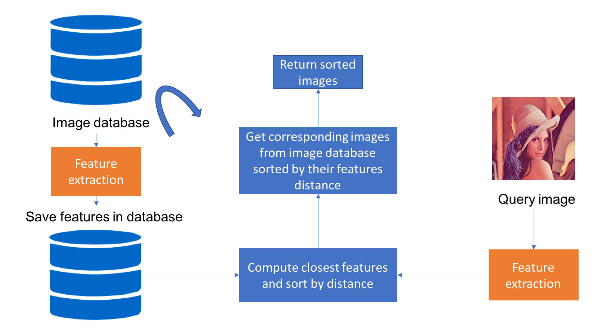

# Content based image retrieval

[Content-based image retrieval][1] (CBIR) is the application of computer vision techniques to the image retrieval problem, that is, the problem of searching for digital images in large databases.

**Content-base** means that the search analyzes the contents of the image rather than the metadata such as keywords, tags, or descriptions associated with the image.

It is carried out in three steps:
1. extraction of features from an image database to form a feature database,
2. extraction of the features of the input image,
3. find the most similar features in the database,
4. return the image associated with the found features

## Purpose

I would like to know which model and distance similarity is the most suitable for finding similar faces. For that, I try:

### Similarity measurement
* Cosine similarity
* Manhattan distance
* Euclidean distance

### features extraction
* [AKAZE][4]
* [ORB][5]
* [SURF][8]
* [VGG16][9]
* [VGG19][10]
* [MobileNet][11]
* [Autoencoder][6]

**The objective is to find the right combination (extraction algorithm & similarity measure) that allows to have relevant answers.**

## Part 1: Dataset

In my exploration, I used the following datasets:

* Fashion dataset [Apparel][2]

## Part 2: Evaluation

CBIR system retrieves images based on feature similarity.
To evaluate my models, I used:

* Mean of Mean Average Precision (MMAP) for robustness of system
* Mean Reciprocal Rank (MRR) for the relevance of the first element
* average time per query

the evaluation formulas is refer to [here][7]

## Part 3: Results (MAP)
|             | Cosinus | Manhattan | Euclidean |
|-------------|:-------:|:---------:|----------:|
|     ORB     |   0.04  |    0.19   |    0.18   |
|     SURF    |   0.03  |    0.22   |    0.17   |
|    AKAZE    |   0.04  |    0.20   |    0.20   |
|    VGG16    |   0.00  |    0.71   |    0.71   |
|    VGG19    |   0.00  |    0.71   |    0.71   |
|  MobileNet  |   0.00  |    0.71   |  **0.72** |
| Autoencoder |   0.03  |    0.52   |    0.52   |

**Demo available**: https://sch-cbir-benchmark.herokuapp.com/

[1]: https://en.wikipedia.org/wiki/Content-based_image_retrieval
[2]: https://www.kaggle.com/trolukovich/apparel-images-dataset
[3]: https://www.kaggle.com/dansbecker/5-celebrity-faces-dataset
[4]: https://docs.opencv.org/4.2.0/db/d70/tutorial_akaze_matching.html
[5]: https://opencv-python-tutroals.readthedocs.io/en/latest/py_tutorials/py_feature2d/py_orb/py_orb.html
[6]: https://en.wikipedia.org/wiki/Autoencoder
[7]: https://web.stanford.edu/class/cs276/handouts/EvaluationNew-handout-1-per.pdf
[8]: https://docs.opencv.org/master/df/dd2/tutorial_py_surf_intro.html
[9]: https://neurohive.io/en/popular-networks/vgg16/
[10]: https://iq.opengenus.org/vgg19-architecture/
[11]: https://www.quantmetry.com/blog/mobilenet-optimisation-de-la-convolution-pour-les-reseaux-de-neurones-embarques/